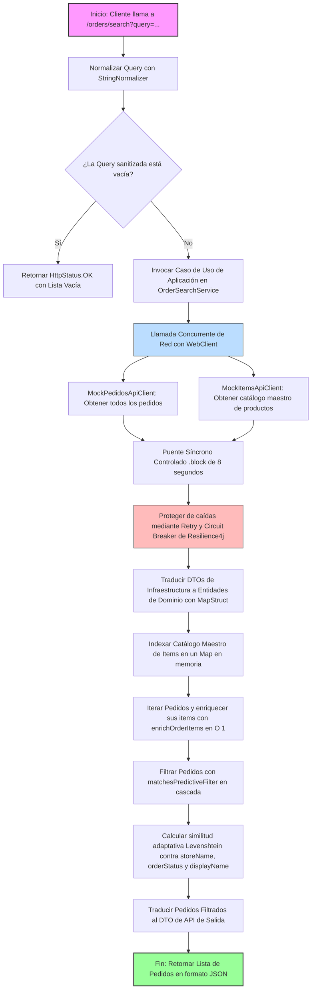

# Módulo de Gestión de Pedidos - Puerto de Liverpool (pedidos-backend)

Este repositorio contiene la implementación del servicio **pedidos-backend**, desarrollado como parte de la evaluación técnica para el equipo de desarrollo de **El Puerto de Liverpool**. El sistema permite gestionar los datos de clientes, sus direcciones de envío y la sincronización con sus correspondientes pedidos y productos consumidos desde servicios externos, utilizando una arquitectura moderna, tolerante a fallos, resiliente y altamente escalable.

---

## 🏗️ Arquitectura y Patrones de Diseño (No MVC)

Para cumplir estrictamente con los lineamientos del examen de **no admitir el patrón MVC tradicional** y asegurar un diseño limpio y mantenible, el proyecto se estructuró bajo los principios de **Clean Architecture (Arquitectura Limpia)** con un enfoque de **Puertos y Adaptadores (Arquitectura Hexagonal)**.

La aplicación se encuentra completamente desacoplada en tres capas principales:

1. **Capa de Dominio (`domain`):** El núcleo de la aplicación. Contiene los modelos de negocio puros (`Customer`, `Order`, `Item`) y las excepciones funcionales. Esta capa es agnóstica a la infraestructura, bases de datos y frameworks.
2. **Capa de Aplicación (`application`):** Define los casos de uso del sistema. Aquí se encuentra la lógica para crear, actualizar, consultar y eliminar clientes, así como el servicio orquestador de búsqueda de pedidos. Orquesta los flujos de datos comunicándose con el exterior a través de **Puertos** (interfaces).
3. **Capa de Infraestructura (`infrastructure`):** Contiene los adaptadores tecnológicos concretos que se conectan con el mundo exterior:
    * **rest (API Inbound):** Define los controladores REST autogenerados por OpenAPI a partir del contrato de diseño.
    * **persistence (DB Outbound):** Adaptador de Spring Data MongoDB para la persistencia física de clientes en MongoDB Atlas.
    * **client (HTTP Outbound):** Adaptador reactivo (usando `WebClient`) para consumir las APIs externas de `/pedidos` e `/items` de forma resiliente y no bloqueante.
    * **mapper:** Traductores de tipos de datos utilizando **MapStruct** para desacoplar DTOs de API, documentos de base de datos y modelos de dominio de manera bidireccional.

---

## 🛠️ Tecnologías y Herramientas Utilizadas

* **Java 17 (LTS)**
* **Spring Boot 3.5.x**
* **MongoDB (Atlas / Local)**
* **Spring WebFlux (WebClient)**
* **OpenAPI Generator (Contract-First)**
* **MapStruct**
* **Lombok**
* **Resilience4j**
* **Testcontainers**

---

## 🚀 Requisitos Previos y Arranque Local

Asegúrate de contar con las siguientes herramientas instaladas en tu entorno local antes de arrancar la aplicación:

* **Java Development Kit (JDK) 17**
* **Apache Maven 3.8+**
* **Docker Desktop**
* Un cliente REST.

### Pasos para Levantar el Proyecto

#### 1. Iniciar MongoDB de forma Local (Docker)
Para arrancar una instancia limpia de MongoDB en un contenedor de Docker expuesto en el puerto estándar (`27017`):
```bash
docker run -d -p 27017:27017 --name mongo-local mongo:latest
```

#### 2. Generar Clases e Interfaces Base (OpenAPI & MapStruct)
Antes del primer arranque, es necesario compilar el proyecto para que Maven genere automáticamente los DTOs, controladores y mapeadores basados en el contrato OpenAPI y las interfaces de MapStruct:
```bash
mvn clean compile
```

#### 3. Arrancar la Aplicación
Una vez compilado el proyecto y con Docker activo, arranca el servidor embebido de Spring Boot:
```bash
mvn spring-boot:run
```
El servicio se iniciará por defecto en el puerto **8080** y con el contexto de versión base **/api/v1** (ej. `http://localhost:8080/api/v1`).

---

## 🧪 Ejecución de la Suite de Pruebas (Testcontainers)

El desarrollo del proyecto incluye una suite de pruebas de integración para la capa de persistencia utilizando **Testcontainers**.

Las pruebas de base de datos se ejecutan de forma aislada y repetible. Testcontainers detectará tu entorno de Docker local, descargará una imagen ligera de **MongoDB 7.0** e iniciará la instancia en un puerto aleatorio efímero exclusivamente para la duración de los tests.

Para ejecutar toda la suite de pruebas unitarias y de integración:
```bash
mvn test
```

---

## 🛡️ Tolerancia a Fallos y Resiliencia (Resilience4j & Netty)

El consumo de las APIs externas de MockAPI de Liverpool (`/pedidos` y `/items`) se realiza mediante un adaptador reactivo de salida configurado con **tolerancia activa a fallos**, blindándolo contra caídas de red, latencia extrema o indisponibilidad del servicio de terceros:

### 1. Aislamiento e Instancias de Resiliencia (Bulkheading)
En el archivo `application.yml`, se configuraron instancias independientes de **Circuit Breaker** y **Retry** para evitar fallas en cascada. Si el servicio de catálogo de productos falla, el circuito de `/items` se abre de manera aislada sin comprometer las consultas al endpoint de pedidos.

```yaml
resilience4j:
  circuitbreaker:
    instances:
      pedidosApi:
        sliding-window-type: COUNT_BASED
        sliding-window-size: 10
        minimum-number-of-calls: 5
        failure-rate-threshold: 50
        wait-duration-in-open-state: 15s
        permitted-number-of-calls-in-half-open-state: 3
        automatic-transition-from-open-to-half-open-enabled: true
      itemsApi:
        sliding-window-type: COUNT_BASED
        sliding-window-size: 10
        minimum-number-of-calls: 5
        failure-rate-threshold: 50
        wait-duration-in-open-state: 15s
        permitted-number-of-calls-in-half-open-state: 3
        automatic-transition-from-open-to-half-open-enabled: true
  retry:
    instances:
      pedidosApi:
        max-attempts: 3
        wait-duration: 2s
        ignore-exceptions:
          - org.springframework.web.reactive.function.client.WebClientResponseException.NotFound
      itemsApi:
        max-attempts: 3
        wait-duration: 2s
        ignore-exceptions:
          - org.springframework.web.reactive.function.client.WebClientResponseException.NotFound
```
---

## 🔍 Motor de Búsqueda Predictiva y Tolerancia Ortográfica (Módulo 4)

Para cumplir con el requerimiento de una búsqueda de tipo **type-ahead** flexible, que sea capaz de omitir acentos, comas, mayúsculas y errores ortográficos mínimos, se diseñó un motor de procesamiento de texto estructurado en dos capas: **Normalización Sanitaria** e **Inferencia de Similitud Difusa**.

### Componentes y Clases del Motor

#### 1. `StringNormalizer` (Clase de Utilidad)
Actúa como la primera barrera sanitaria del texto. Su propósito es homogeneizar tanto la query de búsqueda como los campos del pedido antes de realizar cualquier comparación, eliminando discrepancias superficiales.
* **Lógica de Procesamiento:**
  * Convierte la cadena completa a minúsculas (`toLowerCase()`) y elimina espacios en blanco residuales en los extremos (`trim()`).
  * Utiliza la normalización Unicode en su **Forma de Descomposición (NFD)** para separar los caracteres base de sus acentos o diacríticos.
  * Emplea una expresión regular (`\p{InCombiningDiacriticalMarks}+`) para remover físicamente las marcas de acentuación resultantes.
  * Reemplaza caracteres especiales de puntuación como comas, puntos, guiones, guiones bajos y almohadillas (`[,.\\-_#]`) por espacios en blanco simples.
  * Reduce cualquier secuencia de múltiples espacios consecutivos a un único espacio limpio.

#### 2. `LevenshteinDistance` (Clase de Utilidad)
Implementa la lógica matemática para determinar si dos términos son lo suficientemente similares a nivel ortográfico, permitiendo tolerar errores tipográficos menores de captura por parte del usuario.
* **Lógica de Procesamiento:**
  * **Cálculo de Distancia de Edición:** Calcula el número mínimo de operaciones (inserciones, eliminaciones o sustituciones de caracteres) requeridas para transformar una palabra en otra, implementando el algoritmo iterativo clásico mediante una matriz bidimensional optimizada de tamaño $(M+1) \times (N+1)$ con programación dinámica.
  * **Umbral de Tolerancia Adaptativo (`isSimilar`):**
    1. Si el término de búsqueda está contenido exactamente dentro del campo de destino (búsqueda de subcadena), la coincidencia se aprueba en $O(1)$ sin cálculos extra.
    2. Si no coincide de forma exacta, tokeniza el campo objetivo dividiéndolo por espacios (ej. *"Monterrey Centro"* en *"Monterrey"* y *"Centro"*).
    3. Compara recursivamente la query contra cada token individual.
    4. Aplica un umbral (*threshold*) dinámico: si la query tiene **4 caracteres o menos**, solo se tolera **1 error ortográfico** (distancia $\le 1$). Si tiene **más de 4 caracteres**, se toleran hasta **2 errores ortográficos** (distancia $\le 2$). Esto previene de forma matemática la aparición de falsos positivos en palabras cortas (por ejemplo, evitar que "paz" coincida erróneamente con "pan").

---

### Orquestación de Servicios y Algoritmos

#### 1. Método `enrichOrderItems`
Realiza un **Join de datos en memoria** sumamente eficiente para asociar la información maestro de productos con las referencias contenidas en los pedidos recuperados.
* **Funcionamiento:**
  * Recibe un pedido de dominio (`Order`) y un mapa optimizado de productos indexados por su identificador de negocio (`Map<String, Item> itemsMap`) previamente recolectado de forma concurrente.
  * Ejecuta la búsqueda en el mapa en complejidad constante $O(1)$.
  * **Diseño Defensivo (Integridad de Datos):** Si un producto asociado al pedido no se encuentra registrado en el catálogo maestro de `/items` (relación rota o huérfana en el proveedor de MockAPI), el método **no elimina el artículo** de la lista (evitando corromper la integridad de la orden de compra). En su lugar, emite una advertencia en el log de auditoría (`log.warn`) y preserva la entidad con sus propiedades de identificación base para la visualización del usuario final.

#### 2. Método `matchesPredictiveFilter`
Orquesta la cascada de filtros de coincidencia sobre el pedido ya enriquecido con el catálogo de productos.
* **Funcionamiento:**
  * Aplica un diseño de cortocircuito lógico evaluando cuatro criterios en orden de relevancia; si cualquiera de ellos retorna `true`, el pedido se clasifica como coincidente de inmediato:
    1. **Referencia del Pedido (`orderRef`):** Compara si la query normalizada está contenida parcialmente en el identificador del pedido.
    2. **Nombre de la Tienda (`storeName`):** Utiliza similitud adaptativa de Levenshtein contra el nombre de la tienda.
    3. **Estatus / Fecha de Entrega (`orderStatus`):** Realiza la validación ortográfica difusa contra el campo que almacena la fecha estimada de entrega.
    4. **Nombres de Productos Asociados (`displayName`):** Itera sobre todos los productos previamente enriquecidos de la orden. Aplica el filtro difuso de Levenshtein sobre sus nombres comerciales. Si al menos un producto coincide, se aprueba el pedido completo, asegurando que el JSON de respuesta devuelva el pedido con todos sus artículos intactos (sin filtros físicos sobre la lista final de productos).

---

### 🗺️ Diagrama de Flujo: Búsqueda de Pedidos

A continuación se detalla el flujo de datos y ejecución síncrona/reactiva que se lleva a cabo desde que el cliente realiza la petición de búsqueda en el controlador hasta la entrega del resultado procesado:



---

## 🌐 Flujo de CI/CD (GitHub Actions)

El proyecto cuenta con un flujo automatizado de integración y entrega continua (CI/CD) configurado en GitHub Actions bajo el estándar de GitFlow:

* **Calidad de Código y Validación (CI):** El job `build` se dispara automáticamente en cada `push` o `pull_request` dirigida a las ramas `develop` o `main`. Valida que la aplicación compile exitosamente y que todas las pruebas unitarias pasen en verde antes de permitir el merge.
* **Despliegue Continuo (CD):** El job `publish-and-deploy` se activa de forma exclusiva al fusionar cambios (mediante un evento `push`) en la rama `main`. Construye la imagen Docker de producción utilizando un Dockerfile optimizado en múltiples etapas, la publica en **Docker Hub** y notifica a **Render** mediante un webhook para realizar un redespliegue automático en segundos.

---

## 📖 Documentación de la API (Swagger UI)

Una vez que la aplicación esté corriendo localmente, puedes acceder a la consola interactiva de **Swagger UI** para consultar, probar y validar todos los endpoints expuestos directamente desde el navegador en la siguiente URL:

👉 **http://localhost:8080/api/v1/swagger-ui/index.html**

---

## 🔌 Referencia de Endpoints y Pruebas (cURL)

A continuación se presentan los comandos cURL recomendados para probar las operaciones de Clientes y la Búsqueda de Pedidos de tu servicio local:

### 1. Registrar un Cliente Nuevo (POST)
Crea un cliente asociándole su dirección de envío. El sistema consumirá el MockAPI externo de `/pedidos` de forma no bloqueante, detectará si el `userId` tiene pedidos activos, los mapeará y persistirá el registro en MongoDB:
```bash
curl -X POST http://localhost:8080/api/v1/customers \
  -H "Content-Type: application/json" \
  -d '{
    "userId": "75c97531-abf5-4524-8107-90aa48d08efc",
    "firstName": "Miguel Osbaldo",
    "lastName": "Gallardo",
    "secondLastName": "Toledo",
    "email": "osbald91@gmail.com",
    "shippingAddress": "Ciudad de México"
  }'
```
* **Código HTTP de Éxito:** `201 Created`

### 2. Consultar Cliente por ID (GET)
Recupera el perfil de un cliente junto con sus direcciones de entrega y sus pedidos enriquecidos en tiempo real:
```bash
curl -X GET http://localhost:8080/api/v1/customers/75c97531-abf5-4524-8107-90aa48d08efc
```
* **Código HTTP de Éxito:** `200 OK`

### 3. Actualizar Cliente Existente (PUT)
Permite modificar los datos básicos y la dirección de envío del usuario:
```bash
curl -X PUT http://localhost:8080/api/v1/customers/75c97531-abf5-4524-8107-90aa48d08efc \
  -H "Content-Type: application/json" \
  -d '{
    "firstName": "Miguel",
    "lastName": "Gallardo",
    "secondLastName": "Toledo",
    "email": "osbald91@gmail.com",
    "shippingAddress": "Santa Fe, CDMX"
  }'
```
* **Código HTTP de Éxito:** `200 OK`

### 4. Eliminar un Cliente (DELETE)
Remueve físicamente el registro del cliente de la colección de MongoDB:
```bash
curl -X DELETE http://localhost:8080/api/v1/customers/75c97531-abf5-4524-8107-90aa48d08efc
```
* **Código HTTP de Éxito:** `204 No Content`

### 5. Búsqueda Type-ahead de Pedidos con Tolerancia Ortográfica (GET)
Realiza búsquedas *type-ahead* sobre los pedidos filtrando campos de la orden o nombres comerciales de artículos del catálogo:
```bash
curl -X GET "http://localhost:8080/api/v1/orders/search?query=pants"
```
* **Código HTTP de Éxito:** `200 OK`
* **Ejemplo de Respuesta exitosa (con joins en memoria e integridad de datos activa):**
```json
[
  {
    "orderRef": "3010091676",
    "orderStatus": "2025-12-06",
    "storeName": "L  SANTA FE",
    "canal": "online",
    "items": [
      {
        "itemId": "3010091676-1132351437",
        "quantity": 3,
        "displayName": "Pantalón Levi´s"
      },
      {
        "itemId": "3010091676-1179743767",
        "quantity": 4,
        "displayName": "Vasos cristal 250ml"
      }
    ]
  }
]
```
